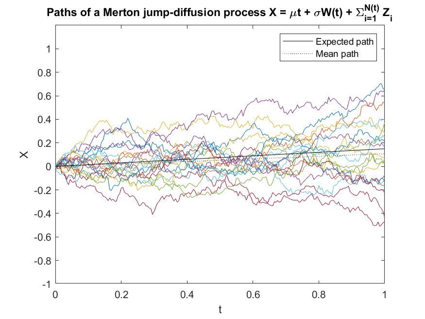
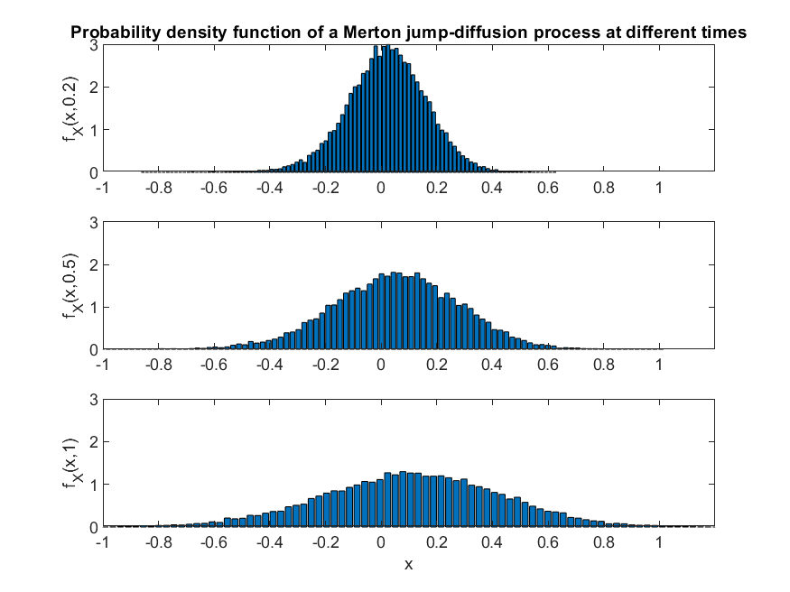
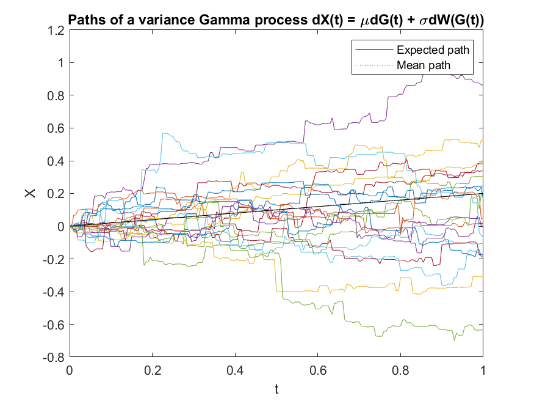
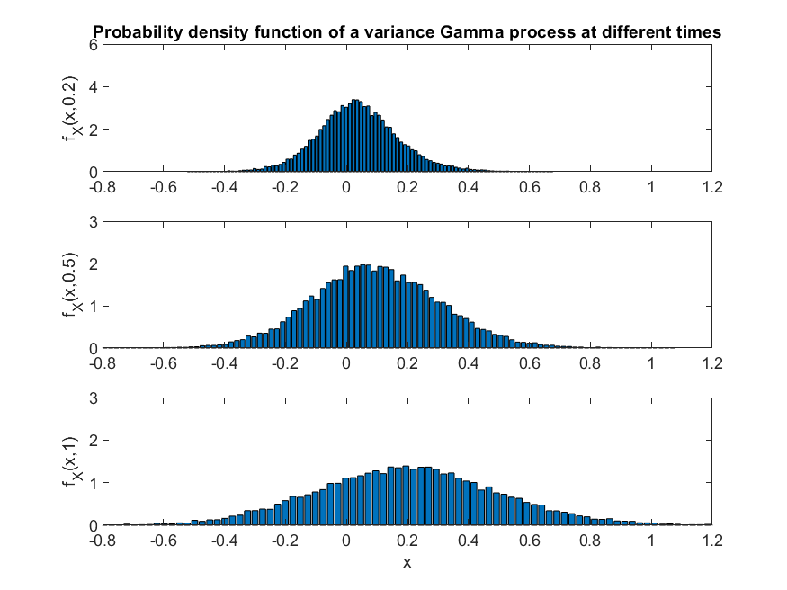

# stochastic-processes-with-jumps
Modelling stochastic processes with jumps to capture extreme market movements 

## Summary of the project
Many studies in finance have assumed that the underlying asset returns were best described by a continuous, diffusion process such as the Geometric Brownian Motion.    Brownian motion has a Gaussian pdf, therefore this assumption cannot generate the fat tails observed in the empirical distributions of returns. For that reason, the literature has advocated the use of jump diffusion processes to explain the behaviour of asset returns. 

Traditionally, models with jumps in finance have relied on Poisson processes, as in Merton (1976), Ball and Torous (1983) and Bates (1991).  These jump-diffusion models allow for a finite number of jumps in a finite time interval, relying on the idea that the Brownian-driven continuous part of the model captures normal asset price variations while the Poisson-driven jump part of the model captures large market movements in response to unexpected information. 

More recently, financial models have been proposed that allow for infinitely many jumps in finite time interval. These models can capture both small and frequent jumps, as well as large and infrequent ones. 

**We have summarised in the attached pdf the following stochastic processes with jumps:**
- Finite Jump Diffusion (JD) processes: like the Merton JD and the Kou Process;
- and Infinite Jump Diffusion processes: like the VG model. 

**Our analysis is implemented in Matlab and it generates the following results:**

